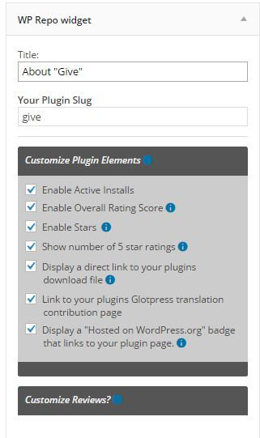

# My Plugin Info Widget
A widget for displaying WordPress plugin info from the WordPress Plugin Directory
---
This WordPress plugin allows you to add a widget to your sidebar, designate a plugin "slug" from any plugin hosted on the WordPress Plugin Directory, and it will show relevant information about that plugin pulled directly from the WordPress Plugin Directory.

It will also show reviews with a fading effect with navigation.

It's also fully templateable, so you can customize it however you like.

---
## Screenshots
**The Widget Settings**

**The Frontend**

---
## To-Do

* Get reviews setting to work properly
* Cache call to the api properly
* Clear the API cache every time the widget is saved
* Cache the widget settings properly
* Clear the widget settings every time a post is saved 
