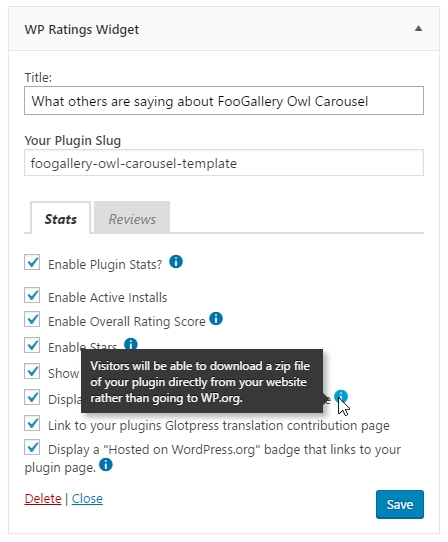
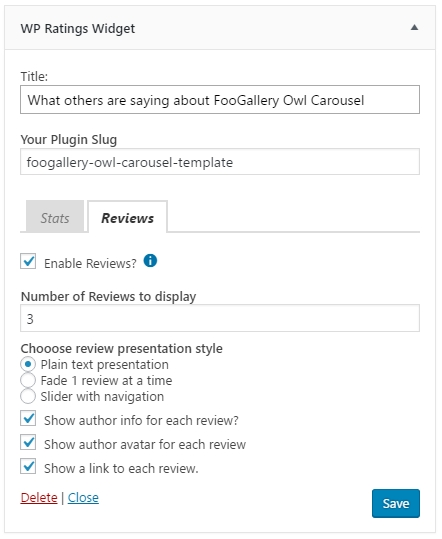

# WP Plugin Rating and Reviews Widget

    

Adds a widget and shortcode to display ratings and reviews about WordPress plugins directly from the WordPress.org Plugin Directory. Ideal for plugin authors to display on their websites.
---
This WordPress plugin allows you to add a widget to your sidebar, designate a plugin "slug" from any plugin hosted on the WordPress Plugin Directory, and it will show relevant information about that plugin pulled directly from the WordPress Plugin Directory.

It will also show reviews with a fading effect with navigation.

It's also fully templateable, so you can customize it however you like.

---
## DEMO

You can currently see it live [here](http://www.mattcromwell.com/products/foogallery-owl-carousel/).

---
## Screenshots
**The Widget Settings**

**The Frontend**

